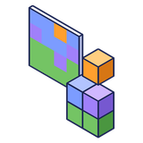

<p align="center">
  
</p>

<h1 align="center">Pixel Art Generator</h1>

<p align="center">
  Turns a picture into blocks: pixel art, a relief, an extruded shape or a rounded 3D guess, with slabs and stairs<br>
  for half-block detail. It splits the picture into colour regions and matches each one to the closest-looking block. Works offline, with no AI.
</p>

<p align="center">
  <a href="https://github.com/doolecg/BlockDesigner-PixelArtGenerator/releases/latest"></a>
  <a href="https://github.com/doolecg/BlockDesigner-PixelArtGenerator/releases"></a>
  <a href="LICENSE"></a>
  
  <a href="https://github.com/doolecg/BlockDesigner"></a>
</p>

---

Pixel Art Generator is a plugin for [BlockDesigner](https://github.com/doolecg/BlockDesigner), the Windows editor for Minecraft builds. It is released
on its own, separately from the app. It needs **BlockDesigner 0.4.17 or later** (plugin API 5).

**Contents:** [Download](#download-and-install) · [Features](#features) · [Building from source](#building-from-source) · [Project layout](#project-layout)

## Download and install

Get the latest version from the [releases page](https://github.com/doolecg/BlockDesigner-PixelArtGenerator/releases/latest):

1. Download `pixel-art-generator-<version>.jar`.
2. In BlockDesigner open **Plugins (puzzle icon) › Manage plugins… › Install…** and pick the jar.

It is on straight away, with an **Pixel Art Generator** page in its tab on the right. You can switch it off, reload or uninstall it in the same window,
and it updates itself (Plugins › Manage plugins… › Update plugins automatically). Plugins run with the same access as BlockDesigner itself, so
only install ones you trust.

## Features

### The Pixel Art Generator page

- **Open a picture** (PNG, JPEG, BMP or GIF), or drop one on the page.
- **Three previews:** the **Picture**, its **Regions** (the colour groups it was split into) and the **Blocks** it will be built from. They update
  as you change the settings.
- **Build as new layer** adds the result as one undo step. **Place with tool** picks the **Place pixel art** tool, which shows the result as ghosts
  where you point: click to place it, and **Shift+wheel** or **R** to turn it. **Copy block list** puts how many of each block it needs on the
  clipboard.
- The settings are remembered between runs.

### Shapes

- **Flat pixel art:** one block thick.
- **Relief / heightmap:** each pixel becomes a column. Its height comes from the picture's **brightness**, from its **colour region**
  (flat layers, like a layer cake) or from a separate **depth image**. You can set the highest and lowest points, smoothing, terraces and
  *dark is high*. A floor makes terrain and a wall makes a carving.
- **Extruded silhouette:** the cut-out outline pushed out to a thickness, with an optional bevel on the front edge.
- **3D: inflate:** the outline blown up like a balloon, thickest far from its edges, so a disc becomes a ball. **Puffiness** makes it flatter
  or rounder.
- **3D: revolve:** each row of the outline spun round a vertical axis, for vases, bottles, towers and trees. Colours wrap round.
- **Slabs and stairs** for half-block detail on slopes and curves, facing uphill the way the game's own stairs do. A block without its own
  slab or stair (concrete, wool) borrows the closest-looking building block's. **Hollow** keeps only a one-block shell.

### From picture to blocks

- **Size:** the width in blocks (up to 512, or 256 for extruded and 3D shapes); the height follows the picture.
- **Build as** a wall facing south, north, east or west (it reads the right way round from that side), or a floor with the top of the picture
  to the north. Walls are matched on the blocks' side faces and floors on their top faces.
- **Blocks:** concrete, wool and terracotta together or on their own, building blocks (stone, bricks, planks, copper, metal and gem blocks…), all solid
  blocks, or your own comma-separated list. Only full, opaque blocks are used, so the build looks like the picture from every angle.
- **Match:**
  - **Regions** gives one block per colour region, for clean, poster-like shapes.
  - **Pixels** gives the closest block for each pixel.
  - **Dithering (smooth)** spreads each pixel's colour error to its neighbours, for gradients such as skies.
  - **Dithering (pattern)** mixes the two closest blocks in a regular pattern.
- **Most kinds of block** limits the build to the N most-used blocks, for survival.
- **Prefer plain-looking blocks** favours flat textures (concrete over cobblestone) when two blocks are about as close.

### Background

- **Auto** leaves out transparent pixels. When the picture has none and its border is mostly one colour, it leaves out that colour, filled
  in from the edges, so a logo on white keeps the white inside its letters.
- Or choose **Transparent pixels**, **Border colour** or **None**.
- The thin blended rim around a cut-out subject is dropped, so it doesn't leave an outline in the backdrop's colour.

### How colours are matched

Colours are compared in OKLab, a colour space where distance follows what the eye sees, so the match looks right rather than being right only
by the numbers. Scaling averages the area each block covers in linear light, so thin lines blend in instead of flickering. Block colours come
from the textures of the Minecraft version and resource packs BlockDesigner has loaded.

### Also from File › Import

Pictures show up in BlockDesigner's **Import** window and can be dropped on the viewport. They are built with the same settings, which the
Import dialog asks for.

### Coming next

Optional local AI helpers, run on your own PC: depth from a photo, background removal and picking blocks by what they show. Also an "all
solid blocks" set that includes modded blocks. See [the plan](docs/plan.md).

## Building from source

You need Windows and a JDK 26 (Temurin 26 is what BlockDesigner uses; set `org.gradle.java.home` in
`gradle.properties` to yours). Then:

```
./gradlew jar      # build/libs/pixel-art-generator-<version>.jar
```

The plugin compiles against the BlockDesigner plugin API jars in [`libs/`](libs) (from BlockDesigner 0.4.19). The app
provides them and JavaFX at runtime, so they are never bundled into the plugin. To target a newer API, replace them
with the jars from a newer BlockDesigner build (`./gradlew :plugin-api:jar :core:jar` in the
[BlockDesigner repository](https://github.com/doolecg/BlockDesigner)) and update the file names in `build.gradle.kts`.

The version is set in `build.gradle.kts` and copied into the jar's `blockdesigner-plugin.json`. To release a new
version, change it there, add a section to [RELEASE_NOTES.md](RELEASE_NOTES.md), build the jar and attach it to a
GitHub release tagged with the version.

For writing plugins, see BlockDesigner's [plugin guide](https://github.com/doolecg/BlockDesigner/blob/main/PLUGINS.md) and
[API reference](https://github.com/doolecg/BlockDesigner/blob/main/docs/plugin-api-reference.md).

### Tests

```
./gradlew test
IMAGE_SHOTS=1 ./gradlew test --tests "*ShotsTest*"   # previews to check by eye, in build/pixel-art-shots
```

The tests cover the picture pipeline without the app or Minecraft's assets, using pictures drawn in code and blocks with known colours.

## Project layout

| Path | What it does |
|---|---|
| `src/main/java/.../pipeline` | Reading, scaling and adjusting the picture (`Prepare`), OKLab, the background (`Background`), colour groups (`KMeans`) and regions (`Segmentation`), and the staged `Pipeline` |
| `src/main/java/.../palette` | The block sets, how blocks look (`BlockColours`, from the texture atlas), matching (`Matcher`) and dithering (`BlockGrid`) |
| `src/main/java/.../shape` | Turning the block grid into a build: `FlatShape`, `ReliefShape`, `SolidShapes` (extrude, inflate, revolve), the half-block field (`HalfField`), slabs and stairs (`SubBlock`), `Orientation` and `Rotate` |
| `src/main/java/.../helpers` | Hooks for optional local AI models (depth, background removal, material tags); none are used yet |
| `src/main/java/.../ui` | The Pixel Art Generator page, the Place pixel art tool and the importer |
| `src/main/resources/blockdesigner-plugin.json` | The manifest BlockDesigner reads: id, name, version, main class, API level |
| `src/test/java` | Tests |
| `libs/` | The BlockDesigner plugin API jars it compiles against |
| `docs/plan.md` | The plan for this plugin and what is done |

## License

[MIT](LICENSE)
